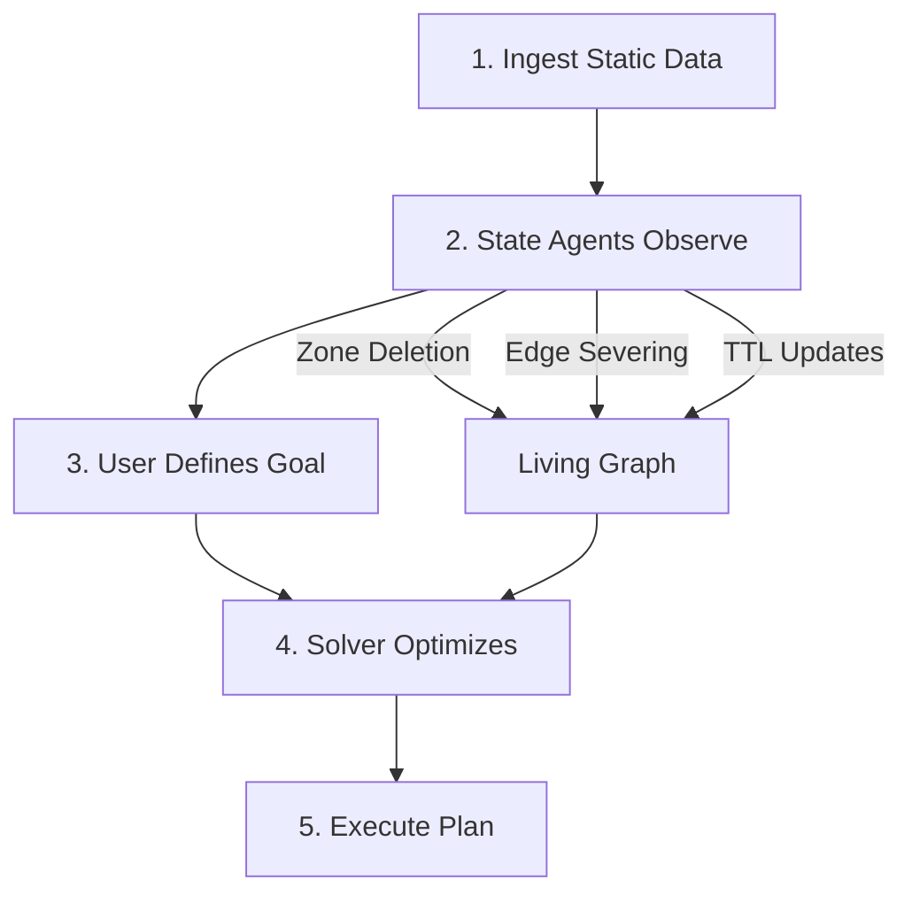

# Ryudo

<p align="center">
  <strong>A General-Purpose Engine for Dynamic Spatial Optimization</strong>
</p>

<p align="center">
  <em>Treating the physical world as a programmable, non-stationary graph where AI Agents define the "Rules of Engagement" in real-time.</em>
</p>

<p align="center">
  <video src="assets/hudhud.mp4" width="100%" autoplay loop muted playsinline></video>
</p>

---


## What is Ryudo?

Ryudo is a smart mapping engine that treats the world as a **living system**. Unlike traditional mapping platforms (Google Maps, Uber) that treat the world as static, Ryudo uses AI agents to constantly update the map based on real-time conditions — whether that's a sudden flood, a traffic jam, or changing soil health.

This allows the platform to solve complex movement optimization problems for **any industry**:

- **Disaster Management** — Guiding rescue boats through a storm
- **Agriculture** — Routing tractors during a short harvest window  
- **Logistics** — Managing delivery fleets in a busy city

Ryudo turns raw data into clear, efficient action plans for any mission.

---

## The Core Abstraction: The "Living Graph"

| Layer | Description |
|-------|-------------|
| **Base Layer** | The static skeleton — OpenStreetMap roads, power grids, waterways |
| **Overlay Layer** | Dynamic properties (weights, availability, risks) constantly rewritten by State Agents |

---

## Architecture


```
┌─────────────────────────────────────────────────────────────────┐
│                     External Signals                             │
│  (Satellite Data, IoT Sensors, Weather APIs)                    │
└──────────────────────────┬──────────────────────────────────────┘
                           │
┌──────────────────────────▼──────────────────────────────────────┐
│               Module A: State Agents                             │
│  ┌─────────────────┐ ┌─────────────────┐ ┌─────────────────┐    │
│  │  Environmental  │ │ Infrastructure  │ │    Temporal     │    │
│  │  (FloodSentinel)│ │ (GridGuardian)  │ │  (TTL Agents)   │    │
│  └────────┬────────┘ └────────┬────────┘ └────────┬────────┘    │
└───────────┼───────────────────┼───────────────────┼─────────────┘
            │ Zone Deletion     │ Edge Severing     │ TTL
            ▼                   ▼                   ▼
┌─────────────────────────────────────────────────────────────────┐
│                      Living Graph                                │
│  ┌─────────────────────┐    ┌─────────────────────────────────┐ │
│  │    Base Layer       │───▶│       Overlay Layer             │ │
│  │  (Static OSM Data)  │    │  (Dynamic Weights/Constraints)  │ │
│  └─────────────────────┘    └─────────────────────────────────┘ │
└──────────────────────────────────┬──────────────────────────────┘
                                   │
┌──────────────────────────────────▼──────────────────────────────┐
│              Module B: Mission Coordinator                       │
│           (OR Solver Engine + Routing Optimizer)                 │
└──────────────────────────────────┬──────────────────────────────┘
                                   │
                                   ▼
                            Action Plan Output
```

---

## State Agents

The platform uses three types of AI agents that **observe reality and constrain the graph**:

### Environmental Agents (The Physics)
Map external forces (weather, terrain, chemical plumes) to spatial zones.  
**Action:** `Zone_Deletion` — *"This polygon is flooded/burning/toxic. Remove it from the graph."*

### Infrastructure Agents (The Network)
Map system dependencies and cascading failures.  
**Action:** `Edge_Severing` — *"Node A failed, so connected Nodes B and C are effectively dead."*

### Temporal Agents (The Clock)
Predict the lifespan of a route or asset.  
**Action:** `Time_To_Live` — *"This edge is valid for 2 hours, then cost becomes Infinity."*

---

## Current Skin: CycloneShield (Disaster Management)

The first implementation demonstrates disaster response optimization:

| Agent | Role |
|-------|------|
| **FloodSentinel** | Removes flooded roads from the graph based on satellite/sensor data |
| **GridGuardian** | Tracks power outages and cascading infrastructure failures |
| **Mission Coordinator** | Routes rescue teams optimally to families in need |

---

## Universal Workflow



1. **Ingest** — Load the generic graph of the region (roads + coordinates)
2. **Observe** — State Agents wake up and modify the graph based on real-time data
3. **Define** — User uploads a demand file (e.g., "Visit these 50 points")
4. **Solve** — The coordinator finds optimal paths through the valid graph
5. **Execute** — Output specific instructions and action plans

---

## Future Skins

| Skin | Context | State Agents | User Goal |
|------|---------|--------------|-----------|
| **CycloneShield** | Cyclone hitting coast | FloodSentinel, GridGuardian | Rescue 50 families |
| **Agri-Mind** | Harvest season with approaching rain | Crop Ripeness Agent, Machinery Health Agent | Harvest 500 acres before Friday |

---

## Reference Docs

- Constraint contract: `docs/constraint_contract.md`
- Performance baseline: `docs/performance_baseline.md`
- Replay and events: `docs/replay_and_events.md`

---

## License

MIT
